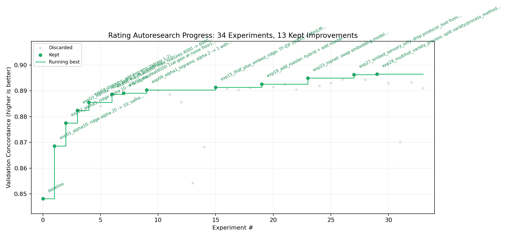

# Coffee Value Autoresearch

**Coffee Value Autoresearch** is the model-development companion to `coffee-value-app`. It trains and evaluates specialty coffee rating and price predictors from production-compatible features, then records the selected model configurations and tradeoffs used by the inference app.

Portfolio highlights:

- Agentic ML experimentation loop with one focused hypothesis per run, a fixed validation split, and an append-only experiment ledger.
- Shared deterministic feature contract for both rating and price models, designed to match fields extractable from real roaster product pages.
- Separate optimization targets for quality rating and USD price per 100g, with explicit validation metrics and model-selection rationale.
- Transparent research trace: kept and discarded experiments are preserved with metrics, caveats, and reasoning.
- Best-model selection grounded in validation performance, error diagnostics, and explicit overfit tradeoffs.

This repo is the research and training layer. The user-facing inference app lives in the companion `coffee-value-app` repo.



*Rating validation progress across autoresearch experiments.*

## What It Builds

The project develops two predictors for specialty coffee listings:

1. **Rating model**: predicts expected coffee quality score from origin, process, variety, roaster country, production flags, and text fields.
2. **Price model**: predicts fair USD price per 100g from the same production-compatible features plus package-size features.

The goal is not just to maximize a leaderboard metric. The selected models need to be reproducible, inspectable, and compatible with fields that can be extracted from public coffee product pages at inference time.

## Research Workflow

The autoresearch workflow is intentionally disciplined:

1. Prepare canonical rows and a fixed validation split.
2. Run one focused experiment at a time.
3. Commit the experimental code before evaluation.
4. Evaluate against the same validation contract.
5. Keep the run only if it improves the chosen tradeoff.
6. Record the run, metrics, and decision in a ledger.

That creates an auditable trail of model development rather than a final artifact with no explanation.

## Selected Models

The selected rating and price models are summarized in [MODEL_SELECTION.md](MODEL_SELECTION.md).

### Rating

Best selected configuration: `exp15` from [autoresearch/rating/results.tsv](autoresearch/rating/results.tsv).

- TF-IDF text features with 6000 max features and bigrams.
- MiniLM sentence embeddings in a hybrid feature matrix.
- Ridge regression with `alpha=1`.
- No roaster identity feature.

Validation summary:

- `val_spearman`: 0.870548
- `val_mae`: 1.047700
- `val_rmse`: 1.556474
- `val_within_1`: 0.623785
- `val_within_2`: 0.867614

### Price

Best selected configuration: `6507aee` from [autoresearch/price/results.tsv](autoresearch/price/results.tsv), selected from the ElasticNet run described as `ElasticNet alpha=0.0001 l1_ratio=0.1 (lower L1 to retain useful small coefs)`.

- Target: `log(price_usd_per_100g_real)`.
- ElasticNet with `alpha=0.0001`, `l1_ratio=0.1`.
- Structured production-compatible features.
- TF-IDF over sensory and producer text, 24000 max features, bigrams.
- Package-size features for `log(package_grams)`, missing package, and tiny/small package flags.

Validation summary:

- `val_rmsle`: 0.259166
- `val_spearman`: 0.787833
- `val_mae`: 3.875031
- `val_median_ae`: 0.968472
- `val_p90_ae`: 5.098572

The package-size features materially improved rare luxury coffee handling, though the highest price decile remains compressed downward.

## Repository Layout

```text
coffee_value/
  features.py              # shared deterministic feature extraction contract

autoresearch/
  rating/
    program.md             # agent instructions and validation contract
    prepare.py             # creates canonical rating rows and fixed split
    train.py               # selected rating research script
    results.tsv            # rating experiment ledger
    notes.md               # human-readable rating run summary
  price/
    program.md             # agent instructions and validation contract
    prepare.py             # creates canonical price rows and fixed split
    train.py               # selected price research script
    results.tsv            # price experiment ledger
    analyze_selected.py    # selected model diagnostic report generator
```

Local datasets and generated artifacts are intentionally ignored:

```text
data/
artifacts/
```

## Reproduce Selected Runs

Place `coffee.csv` at `data/coffee.csv`, then run:

```bash
python3 autoresearch/rating/prepare.py
python3 autoresearch/rating/train.py
python3 autoresearch/price/prepare.py
python3 autoresearch/price/train.py
python3 autoresearch/price/analyze_selected.py
```

The scripts write generated files under `data/`, `data/splits/`, `artifacts/rating/`, and `artifacts/price/`.

## Research Trace

- [Rating program](autoresearch/rating/program.md)
- [Rating results ledger](autoresearch/rating/results.tsv)
- [Rating summary](autoresearch/rating/notes.md)
- [Price program](autoresearch/price/program.md)
- [Price results ledger](autoresearch/price/results.tsv)
- [Selected price analysis](artifacts/price/6507aee_analysis.md)

## Companion App

`coffee-value-app` consumes the selected artifacts and exposes them through a FastAPI service, LLM extraction pipeline, currency normalization layer, and single-page UI for analyzing real coffee product URLs.
