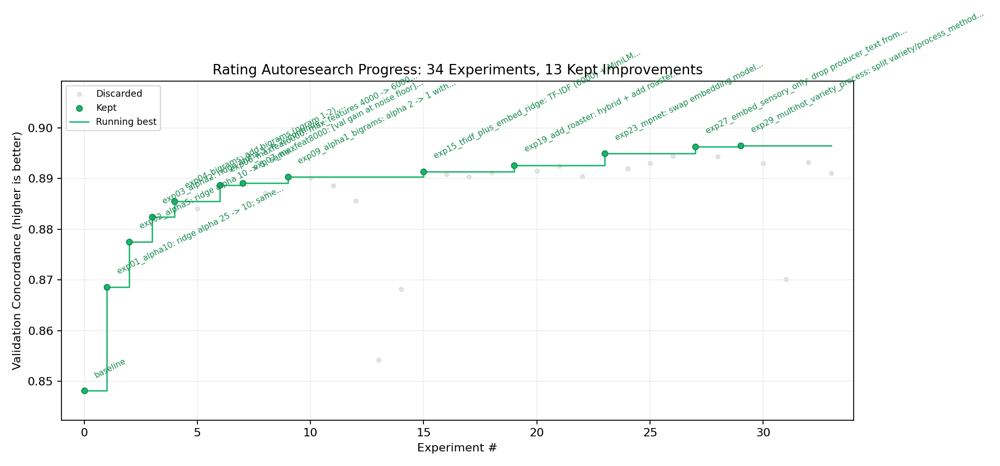

# Coffee Value Autoresearch

[Live app](https://coffee-value-app.onrender.com/)

**Coffee Value Autoresearch** is the specialty coffee model-development companion to [`coffee-value-app`](https://github.com/jintaili/coffee-value-app/). It trains and evaluates the machine learning rating and price models that run in the app backend, using production-compatible features and an explicit model-selection trail.

Highlights:

- Agentic ML experimentation loop with one focused hypothesis per run, a fixed validation split, and an append-only experiment ledger.
- Workflow adapted from Andrej Karpathy's [autoresearch](https://github.com/karpathy/autoresearch) loop: edit, run, measure, keep or discard.
- Shared deterministic feature contract for both rating and price models, designed to match fields extractable from real roaster product pages.
- Separate backend ML models for quality rating and USD price per 100g, with explicit validation metrics and model-selection rationale.
- Transparent research trace: kept and discarded experiments are preserved with metrics, caveats, and reasoning.
- Best-model selection grounded in validation performance, error diagnostics, and explicit overfit tradeoffs.

This repo is the research and training layer for the backend ML models. The user-facing inference app lives in the companion `coffee-value-app` repo.



*Rating validation progress across autoresearch experiments.*

## What It Builds

The project develops two predictors for specialty coffee listings:

1. **Rating model**: predicts expected coffee quality score from origin, process, variety, roaster country, production flags, and text fields.
2. **Price model**: predicts fair USD price per 100g from the same production-compatible features plus package-size features.

The goal is not just to maximize a leaderboard metric. The selected models need to be reproducible, inspectable, and compatible with fields that can be extracted from public coffee product pages at inference time.

## Research Workflow

The autoresearch workflow is intentionally disciplined:

1. Prepare canonical rows and a fixed validation split.
2. Run one focused experiment at a time.
3. Commit the experimental code before evaluation.
4. Evaluate against the same validation contract.
5. Keep the run only if it improves the chosen tradeoff.
6. Record the run, metrics, and decision in a ledger.

That creates an auditable trail of model development rather than a final artifact with no explanation.

## Selected Models

The selected rating and price models are summarized in [MODEL_SELECTION.md](MODEL_SELECTION.md).

### Rating

Best selected configuration: `exp15` from [autoresearch/rating/results.tsv](autoresearch/rating/results.tsv).

- TF-IDF text features with 6000 max features and bigrams.
- MiniLM sentence embeddings in a hybrid feature matrix.
- Ridge regression with `alpha=1`.
- No roaster identity feature.

Validation summary:

- `val_spearman`: 0.870548
- `val_mae`: 1.047700
- `val_rmse`: 1.556474
- `val_within_1`: 0.623785
- `val_within_2`: 0.867614

### Price

Best selected configuration: `6507aee` from [autoresearch/price/results.tsv](autoresearch/price/results.tsv), selected from the ElasticNet run described as `ElasticNet alpha=0.0001 l1_ratio=0.1 (lower L1 to retain useful small coefs)`.

- Target: `log(price_usd_per_100g_real)`.
- ElasticNet with `alpha=0.0001`, `l1_ratio=0.1`.
- Structured production-compatible features.
- TF-IDF over sensory and producer text, 24000 max features, bigrams.
- Package-size features for `log(package_grams)`, missing package, and tiny/small package flags.

Validation summary:

- `val_rmsle`: 0.259166
- `val_spearman`: 0.787833
- `val_mae`: 3.875031
- `val_median_ae`: 0.968472
- `val_p90_ae`: 5.098572

The package-size features materially improved rare luxury coffee handling, though the highest price decile remains compressed downward.

## Repository Layout

```text
coffee_value/
  features.py              # shared deterministic feature extraction contract

autoresearch/
  rating/
    program.md             # agent instructions and validation contract
    prepare.py             # creates canonical rating rows and fixed split
    train.py               # selected rating research script
    results.tsv            # rating experiment ledger
    notes.md               # human-readable rating run summary
  price/
    program.md             # agent instructions and validation contract
    prepare.py             # creates canonical price rows and fixed split
    train.py               # selected price research script
    results.tsv            # price experiment ledger
    analyze_selected.py    # selected model diagnostic report generator
```

Local datasets and generated artifacts are intentionally ignored:

```text
data/
artifacts/
```

## Reproduce Selected Runs

The training data comes from the [Coffee Reviews dataset on Kaggle](https://www.kaggle.com/datasets/megamartzz/coffee-reviews). Place the downloaded CSV at `data/coffee.csv`, then run:

```bash
python3 autoresearch/rating/prepare.py
python3 autoresearch/rating/train.py
python3 autoresearch/price/prepare.py
python3 autoresearch/price/train.py
python3 autoresearch/price/analyze_selected.py
```

The scripts write generated files under `data/`, `data/splits/`, `artifacts/rating/`, and `artifacts/price/`.

## JEV training experiments

The installable `coffee-value-shared` package owns the versioned 38-question
JEV A+B catalog, the TypeSafe HTTP client, and the probability encoder. The
training and extraction scripts import that one contract. The live app still
uses its OpenAI extractor and incumbent artifacts; JEV is a measured research
candidate, not its current serving path. See the
[implementation plan](plans/jev-unified-extraction.html) and the
[combined model and serving extraction pilot](plans/jev-results-showcase.html), plus
the [completed training report](plans/jev-training-results.html). They preserve the existing
split IDs and write their outputs separately under `artifacts/jev/`.

Install this package in a Python environment with the dependencies for the
training scripts before running an extraction:

```bash
python -m pip install -e .
```

The scripts read `TYPESAFE_API_KEY` from the process environment. Each person running
extraction supplies their own key. On macOS, an existing Keychain entry can be used:

```bash
export TYPESAFE_API_KEY="$(security find-generic-password -s typesafe-ai -w)"
```

Alternatively, copy `.env.example` to `.env`, fill in your key, and load that file
in your shell before running the scripts. `.env` is ignored by Git and is not
loaded automatically. Only source a file you created or trust:

```bash
cp .env.example .env
# Edit .env before the next command.
set -a
. ./.env
set +a
```

Then start with the small pilot:

```bash
python3 scripts/backfill_jev.py pilot
```

This sends selected review fields to TypeSafe's System One API. Inspect the pilot's
cached answers, errors, token usage, and cost estimate before the full run:

```bash
python3 scripts/backfill_jev.py full
python3 scripts/evaluate_jev.py
```

The evaluator compares the incumbent with the existing architecture using JEV
features and a JEV-only predictor. It reports incomplete cache coverage instead of
training on a silently reduced dataset. Its generated local report is
`artifacts/jev/summary.html`; the linked report above is a shareable snapshot of
the first complete run. The hybrid improved rating
concordance from 0.8910 to 0.8925 and price RMSLE from 0.2592 to 0.2544. Neither
gain met the plan's acceptance target; the JEV-only predictors performed worse.
These are historical validation results, not measurements of serving speed or
performance on roaster pages. The optional `.env` file and macOS Keychain are local
credential choices, not required repository infrastructure.

The compact [finish and lot-status follow-up](plans/jev-followup-experiment.html)
has a separate, versioned eight-question catalog and cache. Its offline cost
estimate and evaluator can be run without a key:

```bash
python3 scripts/backfill_jev.py pilot --catalog followup --estimate-only
python3 scripts/backfill_jev.py full --catalog followup --estimate-only
python3 scripts/evaluate_jev_followup.py
```

The eight-question follow-up was explored separately. Its evaluator reports
incomplete coverage rather than fitting on a partial cache.

For the current price-focused follow-up, the one-question auction catalog
reuses the original A+B cache. The targeted pilot is selected only from the
price-development split; the full pass covers the 6,661 price-eligible rows.
The [price feature audit](plans/jev-price-feature-priorities.html) explains why
auction status and the existing Panama × Gesha signals were selected.
The [completed comparison](plans/jev-auction-results.html) shows that adding the
auction answer slightly worsened validation RMSLE versus the original JEV hybrid
(0.25480 versus 0.25435). The Panama × Gesha interaction reached 0.25361, a
2.14% improvement over the 0.25917 incumbent, but still above the predeclared
price target of about 0.25139; its exploratory paired
interval crosses zero. Four of 45 auction positives lacked an explicit
auction claim in the supplied text. No price model was promoted for serving.

```bash
python3 scripts/select_jev_auction_pilot.py
python3 scripts/backfill_jev.py pilot --catalog auction --task price \
  --pilot-ids-file artifacts/jev_auction/targeted_pilot_ids.txt
python3 scripts/backfill_jev.py full --catalog auction --task price
python3 scripts/evaluate_jev_auction.py
```

The local serving extraction pilot freezes eight product-page contexts and runs
the current app extractor and the A+B JEV semantic questions twice per page:

```bash
. ../coffee-value-app/.venv/bin/activate  # or another environment with the app dependencies
python scripts/benchmark_jev_serving_extraction.py prepare
python scripts/benchmark_jev_serving_extraction.py run
python scripts/benchmark_jev_serving_extraction.py summary
python scripts/build_jev_results_showcase.py
```

Its measured call medians are 4.81 seconds for the app's full OpenAI extraction
and 0.42 seconds for JEV's 38 semantic answers. JEV does not yet supply the
app's commerce and display fields, so this is an extraction-call pilot rather
than an end-to-end serving speed comparison. See the combined report for p95,
per-page results, and quality findings. The pilot also found incorrect process
labels on two pages. Do not substitute this catalog directly for the app's
complete extraction response.

## Research Trace

- [Rating program](autoresearch/rating/program.md)
- [Rating results ledger](autoresearch/rating/results.tsv)
- [Rating summary](autoresearch/rating/notes.md)
- [Price program](autoresearch/price/program.md)
- [Price results ledger](autoresearch/price/results.tsv)
- [Selected price analysis](artifacts/price/6507aee_analysis.md)

## Companion App

`coffee-value-app` consumes the selected artifacts and exposes them through a FastAPI service, LLM extraction pipeline, currency normalization layer, and single-page UI for analyzing real coffee product URLs.
